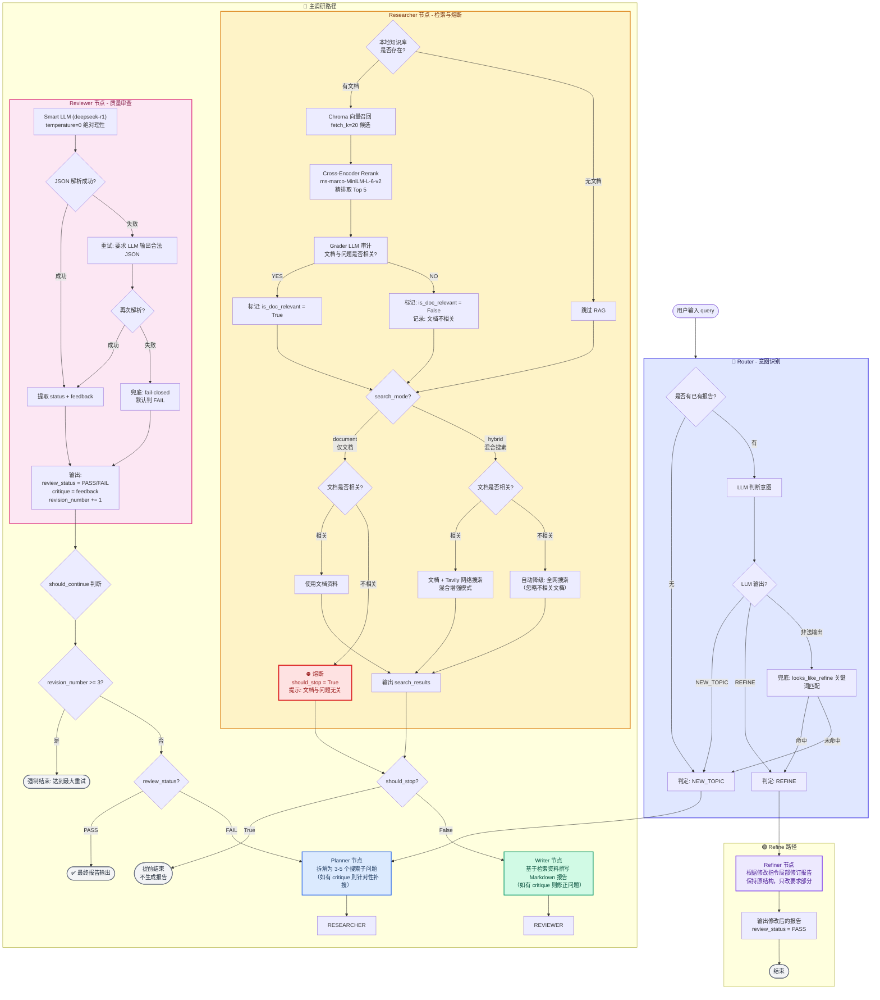
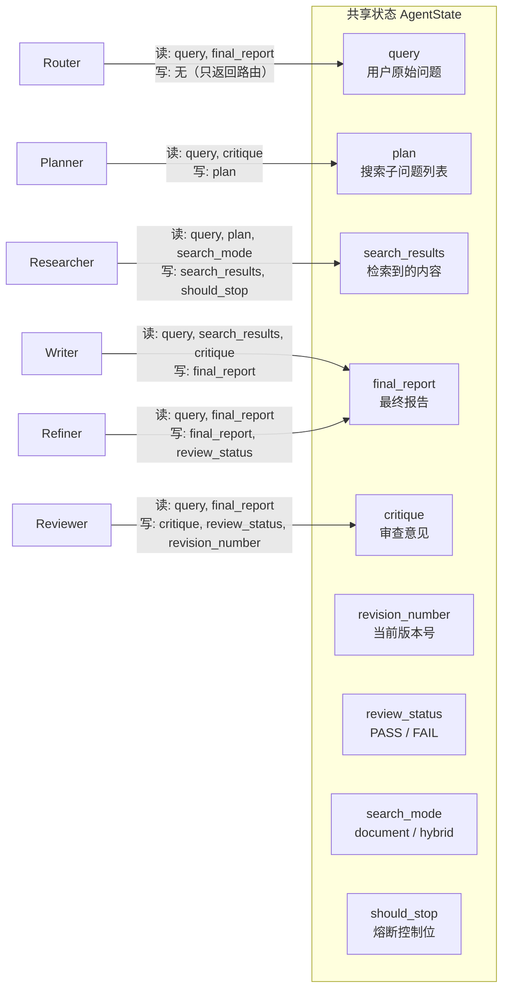
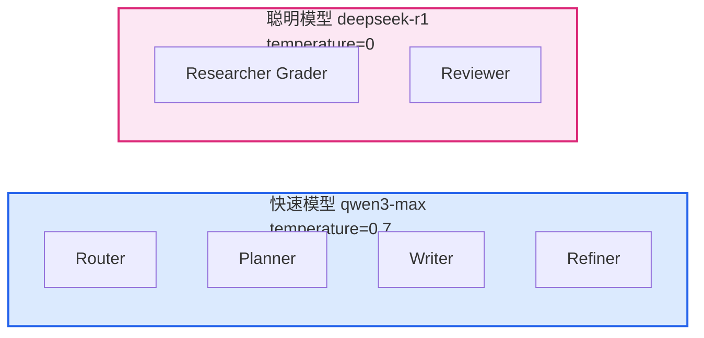

# IRIS 状态机流程图


```mermaid
flowchart TD
    START([用户输入 query]) --> ROUTER

    subgraph ROUTER["🔷 Router - 意图识别"]
        R1{是否有已有报告?}
        R1 -- 无 --> NEW_TOPIC[判定: NEW_TOPIC]
        R1 -- 有 --> R2[LLM 判断意图]
        R2 --> R3{LLM 输出?}
        R3 -- NEW_TOPIC --> NEW_TOPIC
        R3 -- REFINE --> REFINE[判定: REFINE]
        R3 -- 非法输出 --> R4[兜底: looks_like_refine 关键词匹配]
        R4 -- 命中 --> REFINE
        R4 -- 未命中 --> NEW_TOPIC
    end

    NEW_TOPIC --> PLANNER
    REFINE --> REFINER

    subgraph REFINE_PATH["🟢 Refine 路径"]
        REFINER["Refiner 节点<br/>根据修改指令局部修订报告<br/>保持原结构，只改要求部分"]
        REFINER --> REF_OUT["输出修改后的报告<br/>review_status = PASS"]
        REF_OUT --> END2([结束])
    end

    subgraph MAIN_PATH["🔵 主调研路径"]
        PLANNER["Planner 节点<br/>拆解为 3-5 个搜索子问题<br/>（如有 critique 则针对性补搜）"]

        PLANNER --> RESEARCHER

        subgraph RESEARCHER_BLOCK["Researcher 节点 - 检索与熔断"]
            direction TB
            R_RAG{本地知识库<br/>是否存在?}

            R_RAG -- 有文档 --> R_FETCH["Chroma 向量召回 fetch_k=20 候选"]
            R_FETCH --> R_RERANK["Cross-Encoder Rerank<br/>ms-marco-MiniLM-L-6-v2<br/>精排取 Top 5"]
            R_RERANK --> R_GRADER["Grader LLM 审计<br/>文档与问题是否相关?"]
            R_GRADER -- YES --> R_DOC_OK["标记: is_doc_relevant = True"]
            R_GRADER -- NO --> R_DOC_FAIL["标记: is_doc_relevant = False<br/>记录: 文档不相关"]

            R_RAG -- 无文档 --> R_SKIP["跳过 RAG"]

            R_DOC_OK --> R_MODE{search_mode?}
            R_DOC_FAIL --> R_MODE
            R_SKIP --> R_MODE

            R_MODE -- "document<br/>仅文档" --> R_DOC_CHECK{文档是否相关?}
            R_DOC_CHECK -- 相关 --> R_DOC_USE["使用文档资料"]
            R_DOC_CHECK -- 不相关 --> R_CIRCUIT_BREAK["⛔ 熔断<br/>should_stop = True<br/>提示: 文档与问题无关"]

            R_MODE -- "hybrid<br/>混合搜索" --> R_HYBRID{文档是否相关?}
            R_HYBRID -- 相关 --> R_MIX["文档 + Tavily 网络搜索<br/>混合增强模式"]
            R_HYBRID -- 不相关 --> R_AUTO_WEB["自动降级: 全网搜索<br/>（忽略不相关文档）"]

            R_DOC_USE --> R_OUT
            R_MIX --> R_OUT["输出 search_results"]
            R_AUTO_WEB --> R_OUT
        end

        R_CIRCUIT_BREAK --> ROUTE_STOP{should_stop?}
        R_OUT --> ROUTE_STOP

        ROUTE_STOP -- True --> END1([提前结束<br/>不生成报告])
        ROUTE_STOP -- False --> WRITER

        WRITER["Writer 节点<br/>基于检索资料撰写 Markdown 报告<br/>（如有 critique 则修正问题）"]

        WRITER --> REVIEWER

        subgraph REVIEWER_BLOCK["Reviewer 节点 - 质量审查"]
            direction TB
            REV_LLM["Smart LLM (deepseek-r1)<br/>temperature=0 绝对理性"]
            REV_LLM --> REV_JSON{JSON 解析成功?}
            REV_JSON -- 成功 --> REV_RESULT["提取 status + feedback"]
            REV_JSON -- 失败 --> REV_RETRY["重试: 要求 LLM 输出合法 JSON"]
            REV_RETRY --> REV_JSON2{再次解析?}
            REV_JSON2 -- 成功 --> REV_RESULT
            REV_JSON2 -- 失败 --> REV_FALLBACK["兜底: fail-closed<br/>默认判 FAIL"]
            REV_RESULT --> REV_OUT["输出:<br/>review_status = PASS/FAIL<br/>critique = feedback<br/>revision_number += 1"]
            REV_FALLBACK --> REV_OUT
        end

        REV_OUT --> SHOULD{should_continue 判断}

        SHOULD --> CHECK_REV{revision_number >= 3?}
        CHECK_REV -- 是 --> FORCE_END([强制结束: 达到最大重试])
        CHECK_REV -- 否 --> CHECK_STATUS{review_status?}
        CHECK_STATUS -- PASS --> END3([✅ 最终报告输出])
        CHECK_STATUS -- FAIL --> PLANNER
    end

    %% 样式
    classDef routerStyle fill:#e0e7ff,stroke:#4f46e5,stroke-width:2px,color:#1e1b4b
    classDef plannerStyle fill:#dbeafe,stroke:#2563eb,stroke-width:2px,color:#1e3a5f
    classDef researcherStyle fill:#fef3c7,stroke:#d97706,stroke-width:2px,color:#78350f
    classDef writerStyle fill:#d1fae5,stroke:#059669,stroke-width:2px,color:#064e3b
    classDef reviewerStyle fill:#fce7f3,stroke:#db2777,stroke-width:2px,color:#831843
    classDef refinerStyle fill:#ede9fe,stroke:#7c3aed,stroke-width:2px,color:#4c1d95
    classDef endStyle fill:#f3f4f6,stroke:#6b7280,stroke-width:2px,color:#1f2937
    classDef breakStyle fill:#fee2e2,stroke:#dc2626,stroke-width:3px,color:#991b1b

    class ROUTER routerStyle
    class PLANNER plannerStyle
    class RESEARCHER_BLOCK researcherStyle
    class WRITER writerStyle
    class REVIEWER_BLOCK reviewerStyle
    class REFINER refinerStyle
    class END1,END2,END3,FORCE_END endStyle
    class R_CIRCUIT_BREAK breakStyle
```

## 数据流转图


```mermaid
flowchart LR
    subgraph AgentState["共享状态 AgentState"]
        S1["query<br/>用户原始问题"]
        S2["plan<br/>搜索子问题列表"]
        S3["search_results<br/>检索到的内容"]
        S4["final_report<br/>最终报告"]
        S5["critique<br/>审查意见"]
        S6["revision_number<br/>当前版本号"]
        S7["review_status<br/>PASS / FAIL"]
        S8["search_mode<br/>document / hybrid"]
        S9["should_stop<br/>熔断控制位"]
    end

    R["Router"] -->|"读: query, final_report<br/>写: 无（只返回路由）"| S1
    P["Planner"] -->|"读: query, critique<br/>写: plan"| S2
    RES["Researcher"] -->|"读: query, plan, search_mode<br/>写: search_results, should_stop"| S3
    W["Writer"] -->|"读: query, search_results, critique<br/>写: final_report"| S4
    REV["Reviewer"] -->|"读: query, final_report<br/>写: critique, review_status, revision_number"| S5
    REF["Refiner"] -->|"读: query, final_report<br/>写: final_report, review_status"| S4
```

## 双模型策略


```mermaid
flowchart LR
    subgraph Fast["快速模型 qwen3-max<br/>temperature=0.7"]
        direction TB
        F1[Router]
        F2[Planner]
        F3[Writer]
        F4[Refiner]
    end

    subgraph Smart["聪明模型 deepseek-r1<br/>temperature=0"]
        direction TB
        S1[Researcher Grader]
        S2[Reviewer]
    end

    style Fast fill:#dbeafe,stroke:#2563eb,stroke-width:2px
    style Smart fill:#fce7f3,stroke:#db2777,stroke-width:2px
```
```
